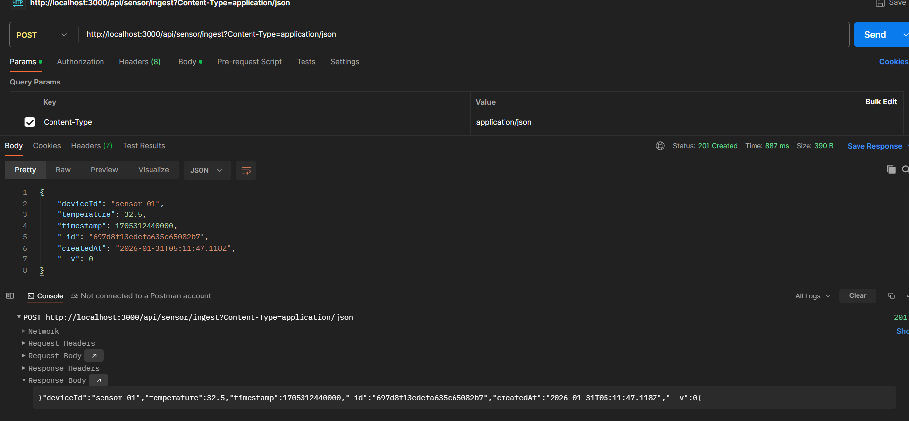
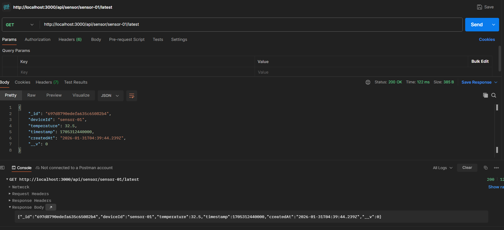

# Falcon Labs – IoT Sensor Backend Assignment

This project is a Node.js backend service that ingests IoT sensor temperature readings, stores them in MongoDB Atlas, and exposes APIs to retrieve the latest reading for a device. It also includes an MQTT subscriber as a bonus feature.

---

## 🚀 Tech Stack

* Node.js (18+)
* Express.js
* MongoDB Atlas
* Mongoose
* MQTT

---

## 📁 Project Setup

### 1️. Clone the repository

```bash
git clone https://github.com/Owaiskadiwal/Falcon_Labs_Backend_Assignment.git
cd Falcon_Labs_Assignment
```

### 2️. Install dependencies

```bash
npm install
```

### 3️. Environment variables

Create a `.env` file in the project root (refer to `.env.example`):

```env
PORT=3000
MONGO_URI=your_mongodb_atlas_connection_string
MQTT_BROKER_URL=mqtt://test.mosquitto.org
```

---

### 4️. Start the server

```bash
npm start
```

Expected output:

```
Server running on port 3000
MongoDB connected
```

---

## API Endpoints

### 1. POST `/api/sensor/ingest`

Stores a temperature reading from a sensor device.

**Request Body (JSON):**

```json
{
  "deviceId": "sensor-01",
  "temperature": 32.5
}
```

**Response:** `201 Created`

---

### 2. GET `/api/sensor/:deviceId/latest`

Returns the latest temperature reading for a given device.

**Example:**

```
GET /api/sensor/sensor-01/latest
```

**Response:** `200 OK`

---

## API Testing Using curl

### Ingest Sensor Data

```bash
curl -X POST http://localhost:3000/api/sensor/ingest \
-H "Content-Type: application/json" \
-d '{"deviceId":"sensor-01","temperature":32.5}'
```

### Get Latest Sensor Reading

```bash
curl http://localhost:3000/api/sensor/sensor-01/latest
```

---

## API Testing Using Postman

### POST – Ingest Sensor Data

* Method: POST
* URL: `http://localhost:3000/api/sensor/ingest`
* Headers:

  * `Content-Type: application/json`
* Body (raw JSON):

```json
{
  "deviceId": "sensor-01",
  "temperature": 32.5
}
```

📸 **Screenshot:**



---

### GET – Latest Sensor Reading

* Method: GET
* URL: `http://localhost:3000/api/sensor/sensor-01/latest`

📸 **Screenshot:**



---

## MQTT Implementation

* The backend subscribes to the topic:

```
iot/sensor/+/temperature
```

* A public MQTT broker is used:

```
mqtt://test.mosquitto.org
```

* Incoming MQTT messages are automatically stored in MongoDB.

> MQTT messages are simulated using a public broker.

---

